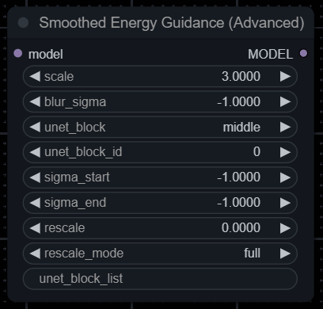

# Perturbed-Attention Guidance and Smoothed Energy Guidance for ComfyUI / SD WebUI (Forge/reForge)

Implementation of [Self-Rectifying Diffusion Sampling with Perturbed-Attention Guidance (D. Ahn et al.)](https://ku-cvlab.github.io/Perturbed-Attention-Guidance/) and [Smoothed Energy Guidance: Guiding Diffusion Models with Reduced Energy Curvature of Attention (Susung Hong)](https://arxiv.org/abs/2408.00760) as an extension for [ComfyUI](https://github.com/comfyanonymous/ComfyUI) and [SD WebUI (Forge)](https://github.com/lllyasviel/stable-diffusion-webui-forge) / [SD WebUI (reForge)](https://github.com/Panchovix/stable-diffusion-webui-reForge).

Works with SD1.5 and SDXL.

> [!NOTE] PAG
> Paper and demo suggest using CFG scale 4.0 with PAG scale 3.0 applied to U-Net's middle layer 0, but feel free to experiment.
>
> Sampling speed without `adaptive_scale` or `sigma_start` / `sigma_end` is similar to Self-Attention Guidance (x0.6 of usual it/s).

## Installation

### ComfyUI

You can either:

- `git clone https://github.com/pamparamm/sd-perturbed-attention.git` into `ComfyUI/custom-nodes/` folder.

- Install it via [ComfyUI Manager](https://github.com/ltdrdata/ComfyUI-Manager) (search for custom node named "Perturbed-Attention Guidance").

- Install it via [comfy-cli](https://comfydocs.org/comfy-cli/getting-started) with `comfy node registry-install sd-perturbed-attention`

### SD WebUI (Forge)

`git clone https://github.com/pamparamm/sd-perturbed-attention.git` into `stable-diffusion-webui-forge/extensions/` folder.

### SD WebUI (Auto1111)

As an alternative for A1111 WebUI you can use PAG implementation from [sd-webui-incantations](https://github.com/v0xie/sd-webui-incantations) extension.

## Guidance Nodes/Scripts

### ComfyUI

### SD WebUI (Forge/reForge)

> [!NOTE]
> You can override `CFG Scale` and `PAG Scale`/`SEG Scale` for Hires. fix by opening/enabling `Override for Hires. fix` tab.
> To disable PAG during Hires. fix, you can set `PAG Scale` under Override to 0.

### Inputs

- `scale`: Guidance scale, higher values can both increase structural coherence of an image and oversaturate/fry it entirely.
- `adaptive_scale` (PAG only): PAG dampening factor, it penalizes PAG during late denoising stages, resulting in overall speedup: 0.0 means no penalty and 1.0 completely removes PAG.
- `blur_sigma` (SEG only): Normal deviation of Gaussian blur, higher values increase "clarity" of an image. Negative values set `blur_sigma` to infinity.
- `unet_block`: Part of U-Net to which Guidance is applied, original paper suggests to use `middle`.
- `unet_block_id`: Id of U-Net layer in a selected block to which Guidance is applied. Guidance can be applied only to layers containing Self-attention blocks.
- `sigma_start` / `sigma_end`: Guidance will be active only between `sigma_start` and `sigma_end`. Set both values to negative to disable this feature.
- `rescale`: Acts similar to RescaleCFG node - it prevents over-exposure on high `scale` values. Based on Algorithm 2 from [Common Diffusion Noise Schedules and Sample Steps are Flawed (Lin et al.)](https://arxiv.org/abs/2305.08891). Set to 0 to disable this feature.
- `rescale_mode`:
  - `full` - takes into account both CFG and Guidance.
  - `partial` - depends only on Guidance.
- `unet_block_list`: Optional input, replaces both `unet_block` and `unet_block_id` and allows you to select multiple U-Net layers separated with commas. SDXL U-Net has multiple indices for layers, you can specify them by using dot symbol (if not specified, Guidance will be applied to the whole layer). Example value: `m0,u0.4` (it applies Guidance to middle block 0 and to output block 0 with index 4)
  - In terms of U-Net `d` means `input`, `m` means `middle` and `u` means `output`.
  - SD1.5 U-Net has layers `d0`-`d5`, `m0`, `u0`-`u8`.
  - SDXL U-Net has layers `d0`-`d3`, `m0`, `u0`-`u5`. In addition, each block except `d0` and `d1` has `0-9` index values (like `m0.7` or `u0.4`). `d0` and `d1` have `0-1` index values.

## ComfyUI TensorRT PAG

To use PAG together with [ComfyUI_TensorRT](https://github.com/comfyanonymous/ComfyUI_TensorRT), you'll need to:

0. Have 24GB of VRAM.
1. Build static/dynamic TRT engine of a desired model.
2. Build static/dynamic TRT engine of the same model with the same TRT parameters, but with fixed PAG injection in selected UNET blocks (`TensorRT Attach PAG` node).
3. Use `TensorRT Perturbed-Attention Guidance` node with two model inputs: one for base engine and one for PAG engine.

